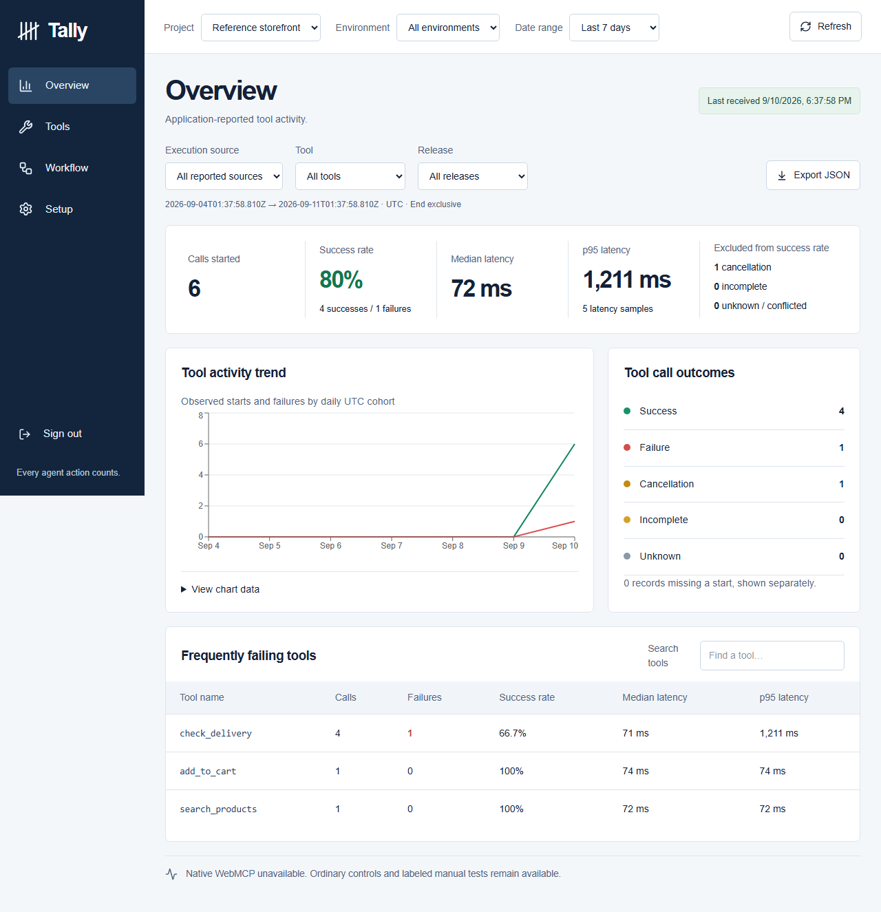

# Tally

**Every agent action counts.**

**Use Tally online:** [tally.alx21.chatgpt.site](https://tally.alx21.chatgpt.site)

Sign in with ChatGPT to create your own projects and view telemetry in the hosted service. Follow the [hosted integration guide](https://tally.alx21.chatgpt.site/guide) to connect your application.

This repository contains the TypeScript SDK and the self-hosted edition described below.

Tally is a private, self-hosted monitor for explicitly instrumented WebMCP execution callbacks. Install the TypeScript SDK, execute tools in your own application, then inspect observed outcomes, latency, workflow completion, and release differences in the authenticated dashboard.

This is a software product, not a contest submission. It runs without a paid service or AI API key. The fictional Field Supply storefront is an integration reference with real telemetry ingestion and simulated orders; it is not the only application the SDK supports.

**Release status:** See [the executed-check report](docs/RELEASE-READINESS.md) before relying on this release. Native integration status, capacity limits, licensing decisions, and remaining limitations are explicit there. The local npm scope `@tally-local` is provisional; no package has been published and availability of the name is not claimed. No license grant has been selected.



## Start a private installation

Requirements: Node.js 24 LTS, **pnpm 11.19.0**, Docker with Compose v2. Ports 3000, 3001 (optional storefront), and 55487 (local PostgreSQL) must be free. These commands work from a checked-out source directory in PowerShell or a POSIX shell.

```sh
npm install --global pnpm@11.19.0
pnpm install --frozen-lockfile
pnpm run init
docker compose --profile app up --build -d
```

Open `http://localhost:3000` after starting your local installation. Read `SETUP_TOKEN` from the generated `.env` locally, enter it in first-owner setup, and choose your own email and password. There are no production default credentials. Keep `.env` private; it contains the database password, authentication secret, and bootstrap token. `pnpm run init` never overwrites an existing `.env`.

Create a project in **Setup**. Enter the allowed browser origins and exact tool/environment/release/error labels. The browser ingestion identifier is public and grants write-only access; your owner session is required to view reports, export, rotate identifiers, change settings, or delete data.

For local development instead of the application container:

```sh
docker compose up -d db
pnpm db:generate
pnpm db:migrate
pnpm --filter @tally-local/sdk build
pnpm dev
```

The initialization command copies local server settings into `apps/tally/.env.local`. After editing `.env`, copy it there again for local Next.js operation; Compose reads the root `.env` directly. Use `localhost`, matching `BETTER_AUTH_URL`, when signing in. See [operations](docs/OPERATIONS.md) for HTTPS, backups, restore, upgrades, recovery, and scheduled retention.

## Install the SDK in another application

Build a distributable archive from this repository:

```sh
pnpm --filter @tally-local/sdk build
pnpm --filter @tally-local/sdk pack --pack-destination ../../artifacts
```

Copy `artifacts/tally-local-sdk-0.1.0.tgz` to an independent application and run:

```sh
npm install ./tally-local-sdk-0.1.0.tgz
```

The archive contains ESM, CommonJS and TypeScript declarations, with **no runtime dependencies or monorepo imports**. Use the copyable project-specific example in Setup and the [integration guide](docs/INTEGRATION.md). SDK version **0.1.0** sends event schema **1**; the versions are independent.

## Reference storefront

```sh
pnpm reference
```

Open `http://localhost:3001` after starting the local reference storefront. In Tally, create a separate project named Reference storefront using the prefilled reference allowlists and origin `http://localhost:3001`. Copy its public ingestion identifier to the storefront and connect. Run the manual test buttons, ordinary product controls, or native tools where supported. Use **v1 + delivery failure**, then **v2 + the same scenario** to observe the corrected release. Use the slow and cancellation scenarios to inspect latency and outcome handling. Saving a simulated order persists it to this browser before recording workflow completion; it does not process a payment.

Manual tests, ordinary application controls and native callbacks have distinct application-reported source labels. Support detection alone is never proof of a native execution. See [compatibility](docs/COMPATIBILITY.md).

## Verify

Use a **disposable local installation** for the verification scripts. The browser suite creates its own random QA owner credential in ignored `work/qa-state.json`. It must never run against an installation with a real owner. Run the dashboard and reference application first.

```sh
pnpm exec tsc --noEmit
pnpm test
pnpm build
pnpm exec playwright install chromium
pnpm test:browser
pnpm test:integration
pnpm test:independent
pnpm test:operations
pnpm exec tsx scripts/native-check.ts
pnpm run licenses
pnpm audit --prod
```

The operations test restarts this Compose database and creates/removes only the named disposable `tally_restore_check` and `tally_upgrade_check` databases. The integration test creates verification projects, manipulates their limit counters, expires verification sessions, and tests the owner login limiter. Do not run these tests on a live installation.

## Documentation

- [SDK installation and API](docs/INTEGRATION.md)
- [Metric definitions and event reconciliation](docs/METRICS.md)
- [Privacy, ingestion contract and resource limits](docs/PRIVACY-AND-INGESTION.md)
- [WebMCP compatibility and native verification](docs/COMPATIBILITY.md)
- [Operation, backup, retention, upgrade and owner recovery](docs/OPERATIONS.md)
- [Executed checks and release readiness](docs/RELEASE-READINESS.md)
- [Implementation checklist and decisions](docs/IMPLEMENTATION.md)
- [Dependency license inventory](docs/DEPENDENCIES.json)
- [Changelog](CHANGELOG.md)
